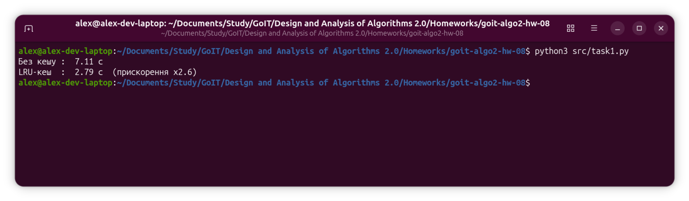
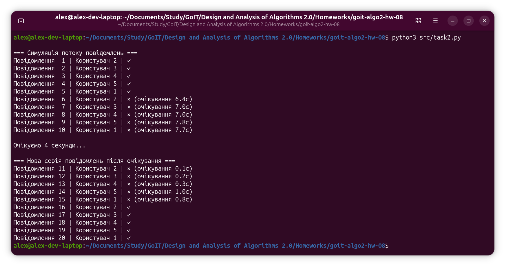

<p align="center">
  
</p>

#### [# goit-algo2-hw-08](https://github.com/topics/goit-algo2-hw-08) <!-- omit in toc -->

## LRU Cache and Sliding Window Rate Limiter implementations in Python <!-- omit in toc -->

This project covers two independent tasks on caching and data flow control algorithms:

* **[LRU Cache](https://en.wikipedia.org/wiki/Cache_replacement_policies#LRU)** - optimizing repeated range sum queries on a large array using a Least Recently Used cache, with benchmarking against the no-cache baseline.
* **Sliding Window** - rate limiting chat messages per user using the Sliding Window algorithm for precise time interval control.

## Table of Contents <!-- omit in toc -->
- [Requirements](#requirements)
  - [Task 1: LRU Cache for Range Query Optimization](#task-1-lru-cache-for-range-query-optimization)
    - [Description](#description)
    - [Technical Requirements](#technical-requirements)
    - [Acceptance Criteria](#acceptance-criteria)
  - [Task 2: Sliding Window Rate Limiter](#task-2-sliding-window-rate-limiter)
    - [Description](#description-1)
    - [Technical Requirements](#technical-requirements-1)
    - [Acceptance Criteria](#acceptance-criteria-1)
- [Tasks Solution](#tasks-solution)
  - [Task 1](#task-1)
  - [Task 2](#task-2)
- [Project Setup \& Run Instructions](#project-setup--run-instructions)
  - [Prerequisites](#prerequisites)
  - [Setting Up the Development Environment](#setting-up-the-development-environment)
    - [Clone the Repository](#clone-the-repository)
  - [Run the code](#run-the-code)
    - [Run code locally](#run-code-locally)
      - [For Linux and macOS:](#for-linux-and-macos)
      - [For Windows:](#for-windows)
- [License](#license)

## Requirements

### Task 1: LRU Cache for Range Query Optimization

#### Description

Implement a program that demonstrates how an LRU cache speeds up repeated "hot" range sum queries on a large integer array.

#### Technical Requirements

1. The input is an array of length N (1 ≤ N ≤ 100 000) of strictly positive integers. Process Q queries (1 ≤ Q ≤ 50 000) of two types:
   - `Range(L, R)` - compute the sum of `array[L : R + 1]`.
   - `Update(index, value)` - assign `array[index] = value`.

2. Implement four functions:
   - `range_sum_no_cache(array, left, right)` - returns the range sum without caching.
   - `update_no_cache(array, index, value)` - updates the element without caching.
   - `range_sum_with_cache(array, left, right)` - looks up the result in an `LRUCache` (capacity K = 1000). On a cache miss (`get` returns -1) computes the sum, stores it with `put`, and returns the result.
   - `update_with_cache(array, index, value)` - updates the array and removes all cache entries whose range contains the modified index. Invalidation is done by a linear scan over cache keys - no other class modification is needed.

3. Use the provided `make_queries` function to generate the query list. Parameters used in this task: `n = 100 000`, `q = 50 000`, `hot_pool = 30` (number of frequently accessed "hot" ranges), `p_hot = 0.95` (probability that a Range query is drawn from the hot pool), `p_update = 0.03` (fraction of Update queries).

4. Measure wall-clock execution time for the full query sequence twice - without cache and with cache - and print the results in a readable format.

#### Acceptance Criteria

1. All four functions `range_sum_no_cache`, `update_no_cache`, `range_sum_with_cache`, `update_with_cache` are implemented and work correctly.
2. The program measures and prints execution time with and without cache.
3. Results are presented in a readable format showing the speedup factor.
4. Code runs without errors and meets technical requirements.

### Task 2: Sliding Window Rate Limiter

#### Description

Implement a message rate limiter for a chat system using the Sliding Window algorithm to prevent spam. The limiter tracks message timestamps per user within a configurable time window and blocks messages when the limit is exceeded.

#### Technical Requirements

1. Use the Sliding Window algorithm for precise time interval control.
2. Default parameters: `window_size = 10` seconds, `max_requests = 1`.
3. Implement class `SlidingWindowRateLimiter` with four methods: `_cleanup_window`, `can_send_message`, `record_message`, `time_until_next_allowed`.
4. Use `collections.deque` for per-user message history.

#### Acceptance Criteria

1. `can_send_message` returns `False` when attempting to send within the window after the limit is reached.
2. The first message from a new user always returns `True`.
3. When all messages expire from a user's window, the user record is removed from storage.
4. `time_until_next_allowed` returns the wait time in seconds.
5. The provided test function runs and produces output matching the expected behavior.

## Tasks Solution

### Task 1

The solution is located in [src/task1.py](src/task1.py).

`LRUCache` is implemented with `collections.OrderedDict`: `get` moves the key to the end (most recently used) and returns the value or `-1` on miss; `put` inserts or updates the key and evicts the least recently used entry when capacity is exceeded.

`range_sum_no_cache` computes the sum directly with Python's built-in `sum`. `update_no_cache` is a plain array assignment.

`range_sum_with_cache` checks the cache by key `(left, right)`. On a miss it computes the sum, stores it, and returns the result. On a hit it returns the cached value immediately - no summation needed.

`update_with_cache` updates the array element and then linearly scans all cache keys, deleting any entry `(l, r)` where `l <= index <= r`. This ensures stale sums are never returned after a mutation.

**Benchmark results (N = 100 000, Q = 50 000):**

| | No cache | LRU cache |
|---|---|---|
| Execution time (sec.) | 16.69 | 6.04 |
| Speedup | - | x2.8 |

The cache is effective because 95% of range queries repeat one of 30 "hot" intervals - these are served instantly from cache after the first computation. The remaining ~3% Updates trigger targeted invalidation, keeping cache consistency without a full flush.

Execution screenshot:



### Task 2

The solution is located in [src/task2.py](src/task2.py).

`SlidingWindowRateLimiter` stores per-user message timestamps in a `deque`. Each operation starts by calling `_cleanup_window`, which pops timestamps older than `window_size` seconds from the front of the deque. If the deque becomes empty, the user entry is removed from the dictionary entirely - satisfying the cleanup requirement.

`can_send_message` returns `True` if the user has no record (first message) or the current window has fewer messages than `max_requests`.

`record_message` calls `can_send_message` logic and, if allowed, appends the current timestamp and returns `True`; otherwise returns `False`.

`time_until_next_allowed` returns the time remaining until the oldest message in the window expires: `window_size - (now - oldest)`, clamped to 0. Returns `0.0` if the user can already send.

Execution screenshot:



## Project Setup & Run Instructions

### Prerequisites

* Python 3.10 or later
* Git (optional, for cloning)

### Setting Up the Development Environment

#### Clone the Repository

```bash
git clone https://github.com/oleksandr-romashko/goit-algo2-hw-08.git
cd goit-algo2-hw-08
```

No external dependencies - all modules used are from the Python standard library.

### Run the code

#### Run code locally

##### For Linux and macOS:

```bash
python3 src/task1.py
python3 src/task2.py
```

##### For Windows:

```bash
python src\task1.py
python src\task2.py
```

## License

This project is licensed under the [MIT License](./LICENSE).
